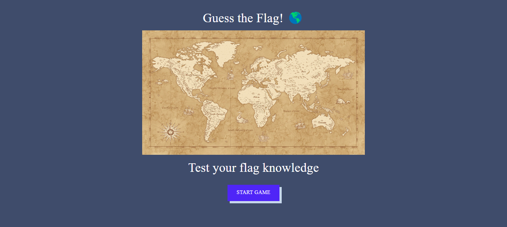

# Guess the Flag! 🌎

<h2 align="center">
  
   
</h2>

A game built using ReactJS and styled using Material UI.

### Overview
Guess The Flag is a fun and interactive game that tests your knowledge of the world's flags. The game randomly generates flags from different countries and the user has to guess the country that corresponds to the flag.

### Features
A fun and interactive way to test your flag knowledge\
A database of flags from different countries\
A scoreboard to keep track of your progress

### Deployment
The game is deployed using Netlify, ensuring a seamless and fast experience for the user.

### Conclusion
Whether you're a geography enthusiast or just looking for a fun way to pass the time, Guess The Flag is the perfect game for you! Test your knowledge and see how you rank on the scoreboard.

To view demo: [click here.](https://gtf-game.netlify.app/)
